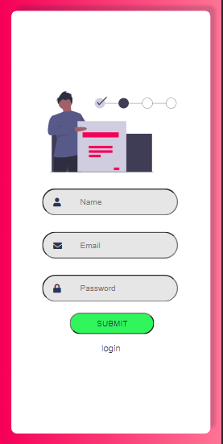

## Node Jwt Login

<h4 align="center">
  Esse é um app só para praticar back-end com node-Js, jwt e React para front-end.
</h4>

<h4 align="center"> Tela de Cadastro</h4>


<h4 align="center"> Responsividade aplicada no projeto</h4>

<div align="center">


</div>

## Tecnologias usadas nesse projeto.

- [ReactJS](https://reactjs.org/)
- [NodeJs](https://nodejs.org/)
- [JWT](https://jwt.io/)

### Requisitos para que você veja o projeto.

- Você Precisa instalar o [Node.js](https://nodejs.org/en/download/) e pode usar o Npm que já vem quando você instala o Nodejs.

**Clone o projeto e entre na pasta**

```bash
$ git clone https://github.com/cesar-machado/Login-node-postgres.git
```

**Para entra na pasta do servidor use:**

```bash
cd server
```

**Para entra na pasta do da página use:**

```bash
cd react-login
```

**Siga os passo abaixo para ativar o projeto**

```bash
# Para instalar as dependências. OBS: faça isso na pasta server e na pasta react-login
$ npm Install

# Para rodar o front-end na pasta react-login use:
$ npm start
```

O projeto estará disponível no seu navegador em `http://localhost:3000`

Existe duas paginas no react-login que são:
`http://localhost:3000/login`
`http://localhost:3000/register`

mas para você ativar o servidor você vai na pasta server use:

```bash
$ npm start
```

O servidor estará disponível no seu navegador em http://localhost:4000

Feito com muito 💜 by César Machado 👋 [Meu LinkedIn](https://www.linkedin.com/in/cesar-mach/)
